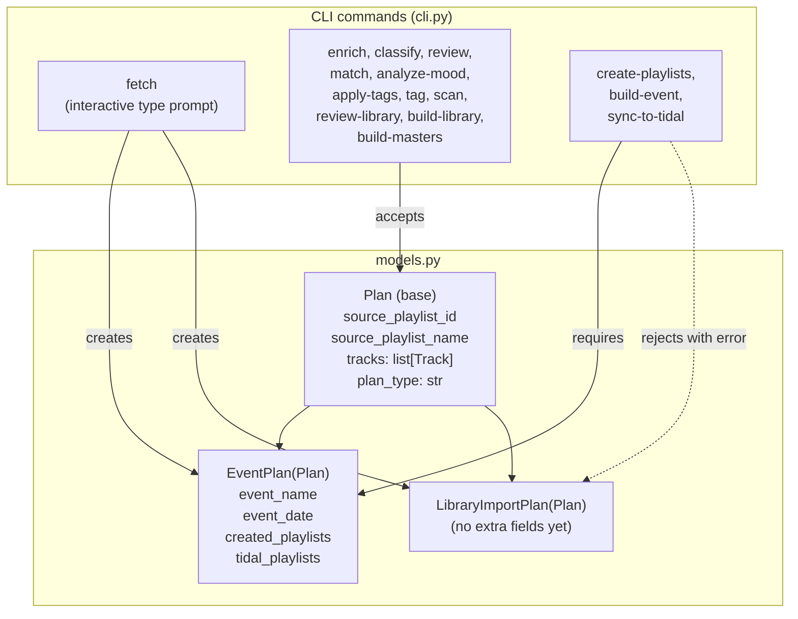

## Context

Cratekeeper is a single-binary Python CLI (`crate`) that processes Spotify playlists through a multi-step pipeline: fetch, enrich, classify, match, analyze, tag, review, and build. The current data model (`EventPlan` in `models.py`) assumes every playlist is an event wishlist, carrying `event_name`, `event_date`, `created_playlists`, and `tidal_playlists` fields. All 16 CLI commands in `cli.py` import and instantiate `EventPlan` directly.

There are no existing ADRs in force.

### Component diagram (after refactor)



**Key boundaries:**
- `Plan` base class owns serialization (save/load) with a `plan_type` discriminator field
- `EventPlan` and `LibraryImportPlan` are thin subclasses; shared logic lives on `Plan`
- Pipeline commands operate on `Plan` (polymorphic); event-only commands type-check and reject `LibraryImportPlan`
- `fetch` is the only command that creates plans; it decides which subclass via interactive prompt

## Goals / Non-Goals

**Goals:**
- Allow DJs to import personal curated Spotify playlists through the full processing pipeline into the master library
- Generalize the data model so pipeline commands are plan-type agnostic
- Maintain backward compatibility with existing `EventPlan` JSON files
- Keep the review-library gate for library imports (consistent quality control)

**Non-Goals:**
- Third-party playlist support (editorial, other DJs) — same mechanism works, but not a design target
- Auto-approval of library imports — review gate stays
- New CLI commands — `fetch` gains interactive prompt, no new top-level commands
- Multiple library profiles (commercial vs electronic) — future work per TODOs.md
- Interactive wizard/orchestrator — future work per TODOs.md

## Decisions

### D1: Plan base class with discriminator field

**Choice:** Extract shared fields from `EventPlan` into a `Plan` base dataclass. Add a `plan_type: str` field (values: `"event"`, `"library-import"`) that acts as a JSON discriminator for deserialization.

**Alternatives considered:**
- *Make event fields optional on EventPlan* — Minimal code change but muddies the model. Every consumer would need to check optionality. Rejected: poor semantics.
- *Separate LibraryImportPlan with no shared base* — Clean separation but duplicates `tracks`, `source_playlist_*`, `save()`, `load()`, `bucket_summary()`. Rejected: DRY violation.

**Rationale:** Inheritance with a discriminator is standard Python dataclass pattern. Keeps pipeline code polymorphic while giving event-only commands a clean type check.

### D2: Discriminator-based deserialization in Plan.load()

**Choice:** `Plan.load(path)` reads the JSON, inspects `plan_type`, and returns the correct subclass. Missing `plan_type` defaults to `"event"` for backward compatibility.

```python
@classmethod
def load(cls, path: Path) -> Plan:
    data = json.loads(path.read_text())
    tracks = [Track(**t) for t in data.pop("tracks", [])]
    plan_type = data.pop("plan_type", "event")
    if plan_type == "library-import":
        return LibraryImportPlan(tracks=tracks, **data)
    return EventPlan(tracks=tracks, **data)
```

**Rationale:** Single entry point for all plan loading. Existing JSON files lack `plan_type` and deserialize as `EventPlan` automatically.

### D3: Interactive plan-type prompt in fetch

**Choice:** `crate fetch` uses `typer.confirm()` or a `rich` prompt to ask: "Is this for an event or a library import?" before creating the plan. No new CLI flag — the interactive prompt keeps the command simple.

**Alternatives considered:**
- *New `crate import-playlist` command* — Separate entry point. Rejected: user chose auto-detect during grill-me.
- *`--library` flag on fetch* — Explicit but forgettable. Rejected: interactive is friendlier for a DJ workflow.

**Rationale:** Single `fetch` command, interactive UX. Non-interactive usage (scripts) can be added later via `--type event|library` flag if needed.

### D4: Type guard for event-only commands

**Choice:** `build-event`, `create-playlists`, and `sync-to-tidal` check `isinstance(plan, EventPlan)` after loading. If the plan is a `LibraryImportPlan`, print a clear error and exit non-zero.

```python
plan = Plan.load(input_file)
if not isinstance(plan, EventPlan):
    console.print("[red]build-event is not applicable to library imports. Use build-library instead.[/red]")
    raise typer.Exit(1)
```

**Rationale:** Fail fast with actionable guidance. Better than silently skipping or producing empty output.

### D5: build-masters accepts both plan types

**Choice:** `build-masters` loads via `Plan.load()` and processes tracks regardless of plan type. Library-import tracks are added to the `[DJ] Genre` Spotify master playlists alongside event tracks.

**Rationale:** Master playlists reflect the DJ's full curated collection. Excluding library imports would create an incomplete picture.

### D6: save() includes plan_type in JSON

**Choice:** `Plan.save()` writes `plan_type` into the JSON output. This is handled in the base class `save()` method.

**Rationale:** Round-trip fidelity. Once saved with `plan_type`, subsequent loads know the correct subclass.

## Risks / Trade-offs

- **Breaking change for code consumers** — Any external code that imports `EventPlan` directly and calls `EventPlan.load()` will still work (backward compat in `Plan.load()`), but callers should migrate to `Plan.load()`. Risk is low since this is a single-user CLI tool.
  → Mitigation: Keep `EventPlan.load()` as a deprecated alias that delegates to `Plan.load()`.

- **Test maintenance** — All existing tests reference `EventPlan` directly. The refactor touches every test that creates or loads plans.
  → Mitigation: `EventPlan` still works as before; tests only need `Plan.load()` where they test polymorphic behavior.

- **Interactive prompt blocks automation** — The `fetch` command becomes interactive by default, which could break scripted usage.
  → Mitigation: Add `--type event|library` flag as escape hatch for non-interactive use. Default to `event` when stdin is not a TTY.

- **Thin LibraryImportPlan** — Currently has no extra fields beyond the base. Could feel like over-engineering.
  → Mitigation: The subclass exists for type-safety and future extensibility (e.g., import source metadata, auto-approve flag). Cost is minimal.

## Migration Plan

1. **Add `Plan` base class** — Extract shared fields and methods from `EventPlan`. `EventPlan` inherits from `Plan` with event-specific fields.
2. **Add `LibraryImportPlan`** — Inherits from `Plan`, no extra fields initially.
3. **Add `plan_type` discriminator** — Default `"event"` in `Plan.save()`. `Plan.load()` dispatches on it.
4. **Update `fetch`** — Add interactive prompt, create correct subclass.
5. **Update pipeline commands** — Change `EventPlan.load()` to `Plan.load()` in: `enrich`, `classify`, `review`, `match`, `analyze-mood`, `apply-tags`, `tag`, `review-library`, `build-library`, `build-masters`.
6. **Add type guards** — `build-event`, `create-playlists`, `sync-to-tidal` reject non-EventPlan.
7. **Update tests** — Adjust imports and add tests for library-import path.

**Rollback:** Revert the commit. Existing JSON files without `plan_type` continue to work since the old `EventPlan` code is the fallback.

## Open Questions

- Should `sync-to-tidal` be event-only or work with library imports? Currently grouped with event-only commands since Tidal sync uses `event_name` for playlist naming. Could be made plan-type agnostic if we use `source_playlist_name` as fallback.
- Should `--type event|library` flag be added to `fetch` from the start for non-interactive use, or deferred until someone needs scripting?
