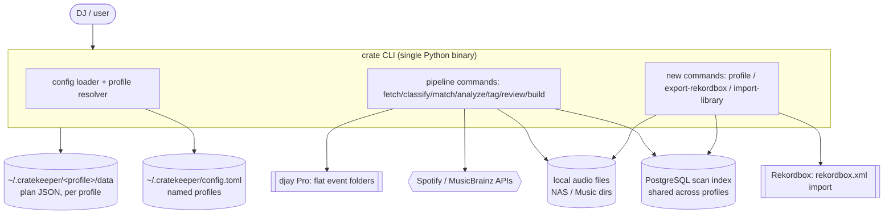
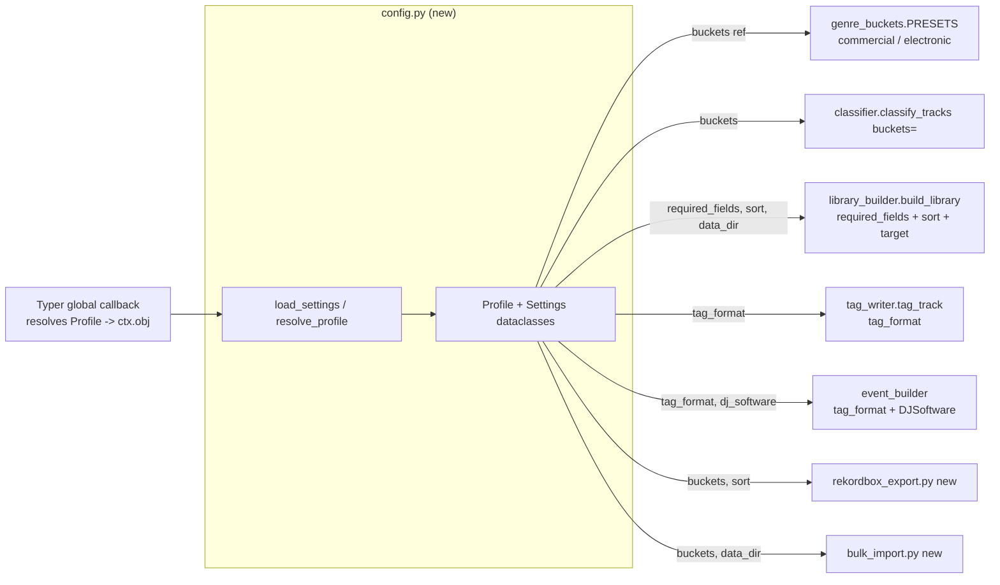
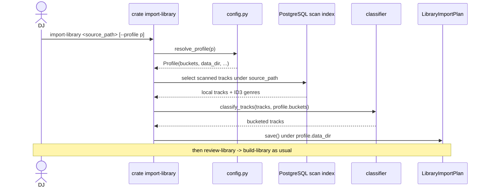

## Context

Cratekeeper (`crate`) is a single-binary Typer CLI that turns Spotify playlists into an organized, analyzed, tagged local crate and curates a master library. Today the pipeline is hardcoded to one configuration:

- One ordered bucket list `DEFAULT_BUCKETS` with `FALLBACK_BUCKET="Pop"` (`genre_buckets.py:26,117`), exposed only via `get_buckets()` (`genre_buckets.py:120`).
- One library target `~/Music/Library` (`cli.py:676`) and flat djay-Pro-style event folders hardcoded in `event_builder.py`.
- One tag strategy: structured comment tags `era:..; energy:..; function:..; crowd:..; mood:..` (`tag_writer.py:8,23`) plus standard ID3 fields, with the marker literal `"energy:"` baked into `event_builder.py:50`.
- One admission gate: `is_fully_tagged` requires `energy AND function AND crowd AND mood_tags` (`library_builder.py:12`).
- One shared plan directory `<repo>/data/` via `DATA_DIR` (`cli.py:16`), used only by `fetch`.

A DJ running both commercial gigs and electronic sets needs two independent libraries with different buckets, folder structures, DJ-software targets (djay Pro vs Rekordbox), tag strategies, admission rules, and sort orders — impossible today without editing code between runs.

Existing seams we can build on:
- `classify_track(track, buckets=None)` and `classify_tracks(tracks, buckets=None)` already accept an optional bucket list (`classifier.py:26,49`) — but the CLI never passes one.
- ADR-0001 (in force) established a `Plan` base class with a `plan_type` discriminator and a thin `LibraryImportPlan` subclass (`models.py:99,118,146`), explicitly to support non-event playlists flowing through the same pipeline.
- File-backed config precedent exists in `spotify_client.py` (search paths, load/save JSON), and env-var-with-default precedent in `local_scanner.py:19` and `mood_analyzer.py`.

**Prior decisions (ADRs in force):** Only `adr/0001-plan-base-class-with-type-discriminator.md` exists; it is `accepted` and not superseded. It is fully coherent with this design — `import-library` reuses `LibraryImportPlan` exactly as ADR-0001 anticipated. No in-force ADR needs revisiting.

## Goals / Non-Goals

**Goals:**
- Introduce a TOML config (`~/.cratekeeper/config.toml`) with named profiles, an `active_profile`, and a per-invocation `--profile` override.
- Make genre buckets, DJ-software target, library output path, admission criteria, sort rules, tag format, and `data_dir` all profile-driven.
- Ship two bucket presets: `commercial` (today's `DEFAULT_BUCKETS`) and a new `electronic` preset (finer EDM granularity, House fallback, no Schlager/Pop/Rock/Latin).
- Add `crate profile` subcommands (`list`, `show`, `use`, `init`).
- Add `crate export-rekordbox` (XML from selected built-library buckets) and `crate import-library` (bulk ID3-based import into a profile).
- Preserve full backward compatibility when no config file exists (implicit `commercial` profile = today's behavior).

**Non-Goals:**
- No migration of existing `data/` plans into profile `data_dir`s (explicitly breaking; user relocates manually).
- No changes to the PostgreSQL scan schema; the scan index stays shared across profiles.
- No new external dependency beyond stdlib `tomllib` (read) / a tiny writer for `init`.
- No GUI, no real-time Rekordbox library mutation (we emit an importable XML, we do not write Rekordbox's DB).
- No per-profile mood-threshold or fuzzy-match-threshold tuning in this change (left as future work).

## Decisions

### D1 — Config format and location: TOML at `~/.cratekeeper/config.toml`
TOML is human-editable, comment-friendly, and parsed by stdlib `tomllib` (Python 3.11+), so reads add zero dependencies. `~/.cratekeeper/` is a new, conventional home-dir config root (distinct from the existing `~/.cache/cratekeeper/models`).

- **Alternative — JSON** (as `spotify_client.py` uses): rejected for config because it has no comments and is hostile to hand-editing, which profiles require.
- **Alternative — keep Python module presets only**: rejected; cannot express per-user library paths or runtime profile switching without code edits.
- **Writing**: `crate profile init` scaffolds the file. Since `tomllib` is read-only, `init` emits a templated string (no `tomli-w` dependency) — we control the exact output.

### D2 — Central `Settings`/`Profile` model loaded once via a Typer global callback
Add `cratekeeper/config.py` exposing immutable dataclasses `Profile` and `Settings`, plus `load_settings()` and `resolve_profile(name | None) -> Profile`. A new `@app.callback()` in `cli.py` resolves the active profile once and stashes it on the Typer `Context` (`ctx.obj`). Every command reads `ctx.obj.profile` instead of module-level constants.

Resolution precedence: `--profile` flag → config `active_profile` → first profile → implicit built-in `commercial` profile (if no config file at all).

- **Alternative — read config lazily inside each command**: rejected; duplicates resolution logic and makes `--profile` global-flag semantics inconsistent.
- **Alternative — global singleton module state**: rejected; Typer `Context` is the idiomatic, testable carrier and avoids import-time side effects.

### D3 — Bucket presets registry; profiles reference a preset or inline custom buckets
Refactor `genre_buckets.py`: `DEFAULT_BUCKETS` becomes the `"commercial"` entry in a `PRESETS: dict[str, BucketPreset]` table; add the `"electronic"` preset. `BucketPreset` carries an ordered `buckets: list[GenreBucket]` and its own `fallback` (Pop for commercial, House for electronic). A profile's `buckets` field is either a preset name (string) or an inline list of `{name, genre_tags}`. `get_buckets()` gains a profile argument and returns the resolved list; the existing `buckets=` params on `classifier.py` are finally threaded through from the CLI.

- **Alternative — single mutable global list**: rejected; cannot hold two presets simultaneously for `--profile` switching within one process/test.

### D4 — DJ-software target as an explicit enum driving tag + output behavior
Introduce `DJSoftware = Literal["djay_pro", "rekordbox"]` on `Profile`. This single field gates three previously-hardcoded behaviors:
1. **Tag format** (see D5).
2. **Auto-XML**: `build-library` for `djay_pro` behaves as today; `rekordbox` profiles do *not* auto-emit XML — Rekordbox XML is produced on demand by `export-rekordbox` (D7).
3. **Event-folder marker/layout**: `event_builder` reads the profile's tag format instead of the literal `"energy:"`.

- **Alternative — infer target from tag format**: rejected; conflates two concerns. An explicit enum is clearer and extensible (future Serato/Traktor).

### D5 — Per-profile tag format: `structured_comment` vs `id3_only`
Add `tag_format: Literal["structured_comment", "id3_only"]` to `Profile`. `tag_writer.tag_track` and `event_builder`'s embedded-comment check take the format from the profile:
- `structured_comment` (commercial): write standard ID3 fields **and** the `era:..; energy:..` comment string (today's behavior).
- `id3_only` (electronic/Rekordbox): write only `genre`, `bpm`, `key`; skip the comment entirely (Rekordbox manages its own metadata).

The scattered structured-tag vocabularies (`VALID_ENERGY/FUNCTION/CROWD/MOOD` inline in `cli.py:809-816`), the comment builder (`tag_writer.py:23`), and the marker literal (`event_builder.py:50`) are consolidated so the format is defined in one place and selected by the profile.

### D6 — Per-profile admission criteria and sorting
- **Admission**: `is_fully_tagged` (`library_builder.py:12`) is generalized to check a profile-supplied `required_fields: list[str]` (default `["energy","function","crowd","mood_tags"]` for commercial; electronic may drop `function`/`crowd`). Same gate is reused by `event_builder._is_fully_tagged` and `review-library` candidacy.
- **Sorting**: `Profile.sort` = `{keys: [...], direction: "asc"|"desc"}` over `Track` numeric/string fields (BPM, energy, danceability, …). `build_library` and the Rekordbox playlist builder order tracks within each bucket accordingly. Default sort preserves current insertion order (no behavior change for commercial).

### D7 — Rekordbox export as a separate command/module
Add `cratekeeper/rekordbox_export.py` and `crate export-rekordbox`. It walks the *built* library (the profile's target dir / its bucket subfolders), reads BPM/key/genre from tags (mutagen), and emits a Rekordbox `rekordbox.xml`: a `<COLLECTION>` of `<TRACK Location=... TotalTime/AverageBpm/Tonality/Genre>` entries plus `<PLAYLISTS>` nodes mirroring the selected genre buckets (`--buckets` filter, default all). Decoupling from `build-library` keeps the build step format-agnostic and lets users regenerate XML without rebuilding.

### D8 — Bulk library import reuses `LibraryImportPlan` (ADR-0001)
Add `cratekeeper/bulk_import.py` and `crate import-library <source_path>`. It reads scanned local files (from the shared PostgreSQL index, filtered by source path), builds `Track`s from ID3 metadata, classifies them using the **profile's buckets** from their existing genre tags (no Spotify), and writes a `LibraryImportPlan` into the profile's `data_dir`. The plan then flows through the normal `classify → review-library → build-library` steps. This is exactly the polymorphic, event-free path ADR-0001 was created for.

### D9 — Per-profile data isolation; shared scan DB
Each `Profile` has `data_dir` (default `~/.cratekeeper/<profile>/data`). All plan JSON load/save for that invocation resolves under the active profile's `data_dir`, replacing the single `DATA_DIR` constant (`cli.py:16`). The PostgreSQL scan index (`local_scanner.py`) stays shared and is unaffected by profile — `rel_path` indexing already makes it library-location agnostic.

### Container view (lightweight C4-inspired)

### Component view — how a profile threads through the CLI

### Dynamic view — `import-library` flow

## Risks / Trade-offs

- **Breaking change: orphaned `data/` plans** -> Document loudly in `init`/README; `crate profile init` prints the old `data/` path and the new `data_dir` so users can relocate manually.
- **Config drift / invalid TOML** -> `config.py` validates on load (unknown preset name, missing path, bad enum) and fails fast with a Rich error pointing at the offending key; `crate profile show` surfaces the resolved effective config.
- **Threading `profile` through ~10 commands is broad and error-prone** -> Single carrier (`ctx.obj.profile`) plus the already-present `buckets=` seams limits the blast radius; cover each command's resolution with tests.
- **Rekordbox XML correctness (paths, encoding, key notation)** -> Rekordbox expects `file://localhost/` URL-encoded locations and Open-Key/Camelot tonality; isolate this in `rekordbox_export.py` with focused unit tests on a few sample tracks before trusting a full export.
- **Tag-format consolidation touches three modules at once** -> Land the consolidated tag-format module first with parity tests against current output, then switch profiles to select it, so commercial behavior is provably unchanged.
- **Shared scan DB + per-profile libraries** -> A track can be admitted to multiple profile libraries from one scan row; acceptable and intended, but `build-library` mutating `track.local_path` to the copied dest (`library_builder.py:105`) must operate on the per-profile plan copy, not the shared index.

## Migration Plan

1. **Add `config.py` + presets, no behavior change.** Implicit `commercial` profile reproduces today's defaults; with no config file, every command behaves identically. Land with parity tests.
2. **Introduce the Typer callback + `ctx.obj.profile`** and thread it through pipeline commands, defaulting to the implicit profile. Still no user-visible change.
3. **Add `crate profile` subcommands** (`init/list/show/use`) so users can opt in.
4. **Add `electronic` preset, `tag_format`, `required_fields`, `sort`, `dj_software`** wiring.
5. **Add `import-library` and `export-rekordbox`** commands/modules.
6. **Rollback strategy**: every step is additive and gated by "no config file = old behavior". Reverting is deleting `~/.cratekeeper/config.toml` (runtime) or reverting the commit (code); no data format in existing plan JSON changes, so old plans still load via `Plan.load`.

## Open Questions

- **`data_dir` default layout**: `~/.cratekeeper/<profile>/data` vs `~/.cratekeeper/data/<profile>` — needs a one-line decision before `config.py` lands (leaning to the former for self-contained per-profile dirs).
- **Rekordbox key notation**: emit Camelot, Open Key, or musical key in `Tonality`? Depends on the DJ's Rekordbox setting; may need a `key_notation` profile field — deferred unless the spec requires it.
- **`--profile` for `scan`**: scan writes the shared DB, so `--profile` is a no-op there. Confirm we accept (ignore) the flag silently vs warn.
- **Config schema versioning**: do we add a `version`/`schema` key to `config.toml` now (cheap forward-compat, mirrors the `plan_type` discriminator pattern) or defer? No in-force ADR blocks either choice.
- **ADR coverage**: ADR-0001 stays in force and coherent. The profile/config architecture (D1–D2) and the DJ-software-target abstraction (D4) are new cross-cutting decisions that likely warrant their own ADR(s) — the `adr` step should record them; nothing here requires *superseding* an existing ADR.
