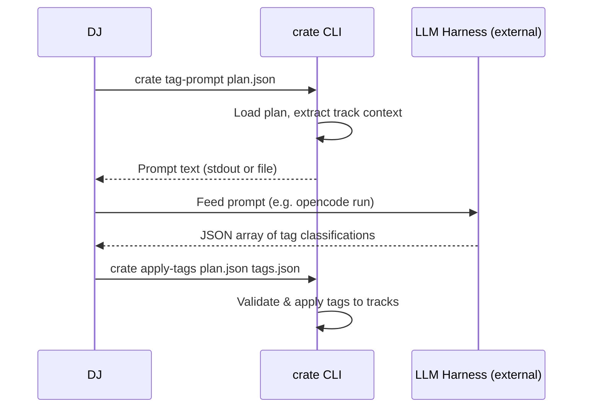
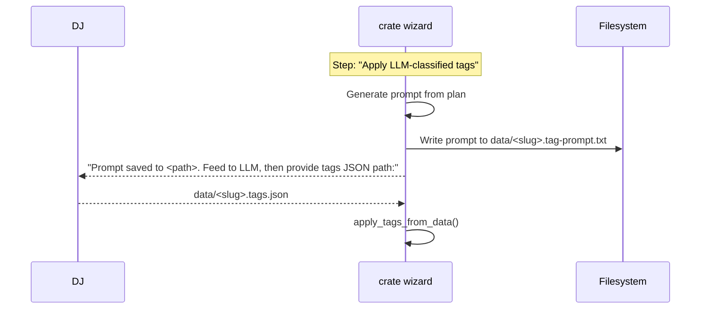

## Context

The CLI pipeline includes an `apply-tags` step that ingests externally-produced LLM tag JSON. Currently, the DJ must manually construct a prompt with track data, vocabulary constraints, and output schema — then paste it into an LLM tool. This is error-prone and tedious, especially for 100+ track plans.

The wizard (`crate wizard`) exposes `apply-tags` as a step requiring a `tags_file` path, but offers no help generating that file. The DJ must leave the wizard, build a prompt, run it through an LLM, save the result, then come back and provide the path.

**In-force ADRs:**
- ADR-0001: Plan base class with type discriminator — `Plan.load()` returns the correct subclass. Pipeline commands accept `Plan` polymorphically. The new command must work with any plan type.

## Goals / Non-Goals

**Goals:**
- Generate a self-contained LLM prompt from plan analysis data via `crate tag-prompt`
- Produce output compatible with `crate apply-tags` (zero schema changes)
- Integrate prompt generation into the wizard's `apply-tags` step
- Support stdout (pipeable) and optional `--output` file

**Non-Goals:**
- No LLM invocation from within the CLI
- No new runtime dependencies
- No changes to `apply-tags` itself
- No batching or streaming support

## Architecture



### Wizard integration (same flow, automated prompting):



## Decisions

### 1. New module `cratekeeper/pipeline/tag_prompt.py`

Single function `build_tag_prompt(tracks: list[Track]) -> str` assembles the full prompt text.

**Rationale:** Keeps prompt logic isolated. Both the CLI command and wizard call the same function. Testable in isolation without file I/O.

**Alternatives considered:**
- Inline in CLI command handler — not reusable from wizard
- Template file loaded at runtime — adds packaging complexity for no benefit; the prompt is short enough to be a Python string

### 2. Prompt includes per-track context line

Each track rendered as a compact one-line record:

```
{id} | {name} | {artists} | bucket:{bucket} | era:{era} | bpm:{bpm} | key:{key} | energy_score:{audio_energy} | mood:{audio_mood} | arousal:{arousal} | valence:{valence}
```

**Rationale:** Pipe-delimited is readable by humans and LLMs. Compact enough that 200 tracks fit well within any modern context window.

### 3. Prompt embeds vocabulary and schema inline

The prompt text includes the valid values for each field and the exact JSON schema expected. No external references.

**Rationale:** Self-contained prompt can be fed to any LLM harness without additional context. The vocabulary is small (4 fields, <30 total valid values).

### 4. `function` and `crowd` output as arrays

Despite the grill-me decision saying "single-value", `apply_tags_from_data()` already treats these as lists (lines 306-310 of `tag_writer.py`). The prompt schema will request arrays to match actual code behavior.

**Rationale:** Match what the code actually does, not what was assumed. Allows tracks to be both "floorfiller" and "singalong".

### 5. Wizard: generate prompt file, then ask for tags path

The wizard's `apply-tags` step gains a pre-step: if no `tags_file` is provided and the step is not yet complete, it generates the prompt to `data/<slug>.tag-prompt.txt`, prints the path, and then prompts for the tags JSON path.

**Rationale:** Keeps the wizard as a single linear flow. The DJ doesn't need to remember to run `crate tag-prompt` separately — the wizard does it automatically. The DJ still controls the LLM invocation externally.

**Alternative considered:**
- Separate wizard step for prompt generation — adds step count, splits a conceptually single operation (classify tags) into two wizard steps.

### 6. CLI command signature

```
crate tag-prompt <plan_file> [--output PATH]
```

- Reads from `Plan.load(plan_file)` — works with EventPlan and LibraryImportPlan per ADR-0001
- Prints to stdout by default (pipeable)
- `--output` writes to file instead

## Risks / Trade-offs

- **[Prompt drift]** → Vocabulary changes in `tag_writer.py` must be reflected in `tag_prompt.py`. Mitigation: `build_tag_prompt` imports `VALID_*` constants from `tag_writer` directly — single source of truth.
- **[LLM output format]** → LLMs may wrap JSON in markdown fences. Mitigation: prompt explicitly says "Return ONLY the JSON array. No markdown, no explanation." The existing `apply-tags` could also strip fences, but that's a separate concern.
- **[Large plans]** → 200+ tracks produce a long prompt. Mitigation: one-line-per-track format keeps it ~20KB for 200 tracks, well within modern model limits.

## Migration Plan

- No breaking changes. New command only.
- Wizard behavior change: existing `apply-tags` step gains prompt generation before asking for file. If `tags_file` already exists at the expected path, wizard skips prompt generation.
- Prepare-event skill doc updated to reference `crate tag-prompt` instead of manual prompt construction.

## Open Questions

- None. All decisions resolved during proposal grilling.
