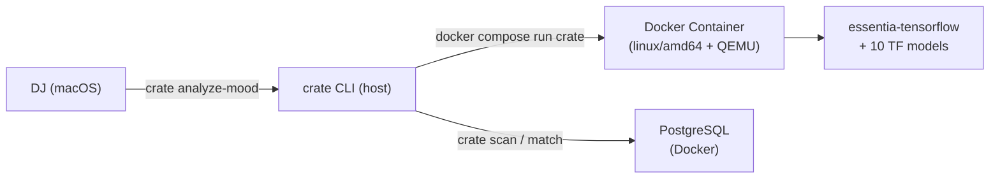
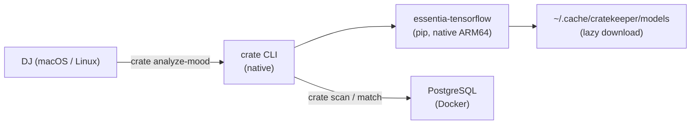

## Context

essentia-tensorflow ships native ARM64 macOS wheels since `2.1b6.dev1389` (Jul 2025). The project currently forces audio analysis through a Docker container (`FROM --platform=linux/amd64 python:3.11-slim-bookworm`) with QEMU emulation on Apple Silicon. This adds significant overhead and operational friction — users must build a ~300 MB Docker image, manage volume mounts, and tolerate 3-5x slower analysis under emulation.

The `mood_analyzer.py` module already supports running outside Docker — it checks `/.dockerenv` to choose between `/app/models` and `~/.cache/cratekeeper/models`, and `_remap_path()` translates host paths to container mount paths. With native essentia, these Docker-specific paths are unnecessary.

Docker Compose currently defines two services: `db` (PostgreSQL) and `crate` (essentia analysis). Only `db` needs to remain.

**In-force ADRs**: ADR-0001 (Plan base class with type discriminator) — accepted, not relevant to this change. No conflicts.

## Goals / Non-Goals

**Goals:**
- Run `crate analyze-mood` natively on macOS Apple Silicon (and Linux x86_64) without Docker
- Make `essentia-tensorflow` a core pip dependency (non-Windows)
- Remove Docker as a requirement for audio analysis
- Keep `docker-compose.yml` for PostgreSQL only
- Maintain lazy model download via existing `_ensure_model()` mechanism

**Non-Goals:**
- Windows support (essentia-tensorflow has no Windows wheels)
- GPU acceleration on Apple Silicon (essentia uses CPU inference)
- Changing the analysis pipeline itself (same models, same features)
- Adding a `crate download-models` pre-download command

## Decisions

### D1: Remove Dockerfile entirely, keep docker-compose.yml for DB only

The Dockerfile exists solely for essentia. With native support, it has no purpose.

- **Chosen**: Delete `Dockerfile`, strip `crate` service from `docker-compose.yml`, keep `db` service.
- **Alternative A**: Keep Dockerfile as fallback for CI/Linux — rejected by stakeholder decision. CI can `pip install essentia-tensorflow` directly.
- **Alternative B**: Keep Dockerfile but make it optional — adds maintenance burden for no clear user.

### D2: Move essentia-tensorflow to core dependencies

Currently in optional `[audio]` extra. Moving to core makes the default install complete.

- **Chosen**: Move to core deps with `platform_system != 'Windows'` marker.
- **Alternative**: Keep as `[audio]` extra — rejected by stakeholder preference for simpler install UX.

### D3: Remove Docker path detection and remapping from mood_analyzer.py

`_default_models_dir()` checks `/.dockerenv`, `_remap_path()` translates host→container paths. Both are Docker-only logic.

- **Chosen**: Remove `_remap_path()` entirely. Simplify `_default_models_dir()` to always use `~/.cache/cratekeeper/models` (respecting `XDG_CACHE_HOME` and `ESSENTIA_MODELS_DIR` override).
- **Alternative**: Keep `_remap_path()` for backward compat — no users run the Docker path outside Docker, dead code.

### D4: Update error messages to remove Docker references

`extract_features()` raises `ImportError` suggesting Docker. Should direct to `pip install essentia-tensorflow`.

- **Chosen**: Update error message to: `"essentia-tensorflow is not installed. Run: pip install essentia-tensorflow"`.

## Architecture (Before → After)

### Before: Container-level view

### After: Container-level view

**Key change**: The Docker container layer between user and essentia is eliminated. CLI runs natively, analysis runs natively. Only PostgreSQL remains in Docker.

## Risks / Trade-offs

- **[Risk] macOS 15+ required** — ARM64 wheels target `macosx_15_0`. Users on older macOS cannot install. → Mitigation: document minimum macOS version. Older macOS users can build from source or use Rosetta/x86_64 Python.
- **[Risk] First-run model download ~300 MB** — without Docker baking models in, first `analyze-mood` invocation downloads 10 models. → Mitigation: existing `_ensure_model()` handles this with per-file download + caching. Document in README.
- **[Risk] essentia-tensorflow version pinning** — current pin is `>=2.1b6.dev1110`, but ARM64 wheels start at `dev1389`. → Mitigation: bump minimum to `>=2.1b6.dev1389`.
- **[Risk] Breaking change for Docker users** — anyone running `docker compose run crate analyze-mood` will find the service gone. → Mitigation: document migration in README. The native path is strictly better.

## Migration Plan

1. Update `pyproject.toml`: move `essentia-tensorflow>=2.1b6.dev1389` to core deps, remove `[audio]` extra.
2. Remove `_remap_path()` and `/.dockerenv` checks from `mood_analyzer.py`.
3. Update error message in `extract_features()`.
4. Delete `Dockerfile`.
5. Strip `crate` service from `docker-compose.yml`, keep `db` only.
6. Update documentation: README, openspec/config.yaml, prepare-event skill, audio-analysis spec.
7. Reinstall project in venv to verify native essentia works.

No rollback strategy needed — this is a development tool, not a production deployment. Users can `git revert` if needed.

## Open Questions

_(none — all decisions resolved during proposal phase)_
