## Context

The `cratekeeper` CLI (`crate`) is a single-binary Python tool that manages a DJ's music pipeline from Spotify playlist → genre classification → local file matching → audio analysis → tagging → event/library folders. The current codebase has accumulated several structural problems:

- `cli.py` is 1238 lines of mixed command wiring and business logic
- `wizard.py` (730 lines) duplicates pipeline logic from `cli.py`
- No abstraction over PostgreSQL — domain code calls psycopg2 directly
- Config data (genre buckets, mood config) is baked into Python source files
- The repo itself is double-nested (`cratekeeper-cli/cratekeeper-cli/`), making tooling awkward

In-force ADRs constraining this design:
- **ADR-0001** (accepted): `Plan` base class with type discriminator. `Plan.load()` dispatches to `EventPlan` or `LibraryImportPlan`. Pipeline commands must remain polymorphic on `Plan`.

---

## Goals / Non-Goals

**Goals:**
- Flatten the double-nested repo layout to a single project root
- Split `cratekeeper/` into domain sub-packages aligned with pipeline stages
- Reduce `cli.py` to thin Typer command wrappers (no inline business logic)
- Make `wizard.py` delegate to CLI handlers instead of re-implementing steps
- Introduce a `TrackRepository` protocol so the local-scan/match domain is testable without PostgreSQL
- Move `genre_buckets` and `mood_config` data structures to YAML files loaded at startup
- All 9 existing tests pass after the refactor
- Public CLI surface (`crate <command>`) unchanged

**Non-Goals:**
- Changing the pipeline's behaviour (this is a structural refactor only)
- Replacing PostgreSQL with another database
- Adding new pipeline commands or capabilities beyond `repository-layer`
- Improving test coverage beyond fixing broken import paths

---

## Decisions

### D1 — Domain sub-package layout

Split the flat `cratekeeper/` package into sub-packages by pipeline domain:

```
cratekeeper/
├── cli.py              # Typer app, thin command handlers
├── wizard.py           # Interactive guide, delegates to CLI handlers
├── models.py           # Plan, EventPlan, LibraryImportPlan, Track, etc.
├── config.py           # Config loading (env vars, profile)
├── data/
│   ├── genre_buckets.yaml
│   └── mood_config.yaml
├── spotify/
│   ├── client.py       # was spotify_client.py
│   ├── tidal.py        # was tidal_client.py
│   └── musicbrainz.py  # was musicbrainz_client.py
├── local/
│   ├── scanner.py      # was local_scanner.py
│   ├── matcher.py
│   ├── bulk_import.py
│   ├── repository.py   # NEW: TrackRepository protocol + in-memory stub
│   └── pg_repository.py # NEW: PostgreSQL implementation
├── pipeline/
│   ├── classifier.py
│   ├── tag_writer.py
│   └── sorting.py
├── builder/
│   ├── event_builder.py
│   ├── library_builder.py
│   └── review_library.py
├── analysis/
│   └── mood_analyzer.py
└── export/
    └── rekordbox.py    # was rekordbox_export.py
```

**Rationale**: Domain grouping mirrors the mental model of the pipeline (fetch → classify → match → analyse → build → export). It makes it obvious where new code belongs and enables per-domain imports in tests.

**Alternative considered**: Layer-based split (`cli/`, `domain/`, `infra/`). Rejected — the pipeline stages are the natural boundary here; layering would scatter related code (e.g., Spotify fetching split across domain and infra).

---

### D2 — Thin CLI handlers

Each Typer command in `cli.py` calls one function from the relevant domain module and handles only:
1. Argument parsing / validation (Typer does most of this)
2. Loading the plan file
3. Calling the domain function
4. Saving the updated plan file
5. Rich console output (progress, errors)

No loops, no file I/O, no API calls inside command handlers.

**Rationale**: Testability. Domain functions can be called directly in tests without invoking the Typer app.

---

### D3 — Wizard delegates to CLI handlers via Typer context

`wizard.py` calls the same Typer command functions using `ctx.invoke(command_fn, ...)`. This is the standard Typer/Click pattern for one command invoking another programmatically.

```python
# wizard.py example
from cratekeeper.cli import fetch, classify

@wizard_app.command()
def run(ctx: typer.Context, ...):
    ctx.invoke(fetch, playlist_url=url, ...)
    ctx.invoke(classify, plan_file=plan, ...)
```

**Rationale**: Single source of truth for each pipeline step. Wizard gets the same business logic and output as direct CLI use.

**Alternative considered**: Wizard calls domain functions directly (bypassing CLI). Rejected — would bypass Rich progress output and error handling already in CLI handlers, requiring duplication.

---

### D4 — TrackRepository protocol

Introduce a `TrackRepository` protocol (structural typing via `typing.Protocol`) in `cratekeeper/local/repository.py`:

```python
class TrackRepository(Protocol):
    def upsert(self, track: LocalTrack) -> None: ...
    def find_by_isrc(self, isrc: str) -> LocalTrack | None: ...
    def find_by_path(self, path: str) -> LocalTrack | None: ...
    def all(self) -> list[LocalTrack]: ...
```

`PostgresTrackRepository` in `pg_repository.py` implements this against psycopg2. An `InMemoryTrackRepository` (dict-backed) lives in `repository.py` for tests.

`scanner.py` and `matcher.py` accept a `TrackRepository` argument; `cli.py` constructs and injects `PostgresTrackRepository`.

**Rationale**: Tests can use `InMemoryTrackRepository` without a live DB. Production behaviour is identical. No new runtime dependency (psycopg2 stays).

---

### D5 — Config-as-code → YAML data files

`genre_buckets.py` and `mood_config.py` are replaced with `cratekeeper/data/genre_buckets.yaml` and `cratekeeper/data/mood_config.yaml`. A loader module (`cratekeeper/config.py` or a dedicated `cratekeeper/data/__init__.py`) reads these at import time using `importlib.resources` (Python 3.9+) so the YAML is included in the installed package.

`pyyaml` added as a runtime dependency in `pyproject.toml`.

**Rationale**: Data structures in Python source files are edited like code but aren't code — no logic, just dicts/lists. YAML is more readable and avoids syntax errors from accidental Python mutations.

---

### D6 — Flatten repo layout

Move `cratekeeper-cli/cratekeeper-cli/{pyproject.toml,cratekeeper/,tests/,Dockerfile}` up one level to the repo root. The outer `cratekeeper-cli/` directory disappears.

`pyproject.toml` package path (`packages = [{include = "cratekeeper"}]`) is unchanged after the move. CI, Dockerfile `COPY` paths, and `release.sh` updated accordingly.

**Rationale**: Standard single-project Python repo layout. Eliminates confusion about which directory is the project root.

---

## Architecture — Component Diagram

The `crate` CLI is a single deployable unit. The diagram shows its internal component boundaries after refactoring.

```mermaid
flowchart TD
    User(["User / Terminal"])
    User -->|crate command| CLI

    subgraph cratekeeper ["cratekeeper package"]
        CLI["cli.py\n(Typer commands)"]
        Wizard["wizard.py\n(ctx.invoke)"]
        Models["models.py\n(Plan, Track)"]
        Config["config.py\n(env / profiles)"]

        subgraph spotify ["spotify/"]
            SpotifyClient["client.py"]
            TidalClient["tidal.py"]
            MB["musicbrainz.py"]
        end

        subgraph local ["local/"]
            Scanner["scanner.py"]
            Matcher["matcher.py"]
            BulkImport["bulk_import.py"]
            Repo["repository.py\n(Protocol + InMemory)"]
            PGRepo["pg_repository.py\n(PostgreSQL impl)"]
        end

        subgraph pipeline ["pipeline/"]
            Classifier["classifier.py"]
            TagWriter["tag_writer.py"]
            Sorting["sorting.py"]
        end

        subgraph builder ["builder/"]
            EventBuilder["event_builder.py"]
            LibBuilder["library_builder.py"]
            ReviewLib["review_library.py"]
        end

        subgraph analysis ["analysis/"]
            MoodAnalyzer["mood_analyzer.py"]
        end

        subgraph export ["export/"]
            Rekordbox["rekordbox.py"]
        end

        Data[("data/\ngenre_buckets.yaml\nmood_config.yaml")]
    end

    Spotify(["Spotify API"])
    Tidal(["Tidal API"])
    MBrainz(["MusicBrainz API"])
    PG[("PostgreSQL")]
    Docker(["Docker / Essentia"])
    AudioFiles(["Local audio files"])

    CLI --> Wizard
    CLI --> Models
    CLI --> Config
    CLI --> SpotifyClient
    CLI --> Scanner
    CLI --> Matcher
    CLI --> Classifier
    CLI --> TagWriter
    CLI --> EventBuilder
    CLI --> LibBuilder
    CLI --> MoodAnalyzer
    CLI --> Rekordbox

    Wizard -->|ctx.invoke| CLI

    Classifier --> Data
    MoodAnalyzer --> Data

    Scanner --> Repo
    Matcher --> Repo
    PGRepo --> PG
    Scanner --> AudioFiles
    TagWriter --> AudioFiles

    SpotifyClient --> Spotify
    TidalClient --> Tidal
    MB --> MBrainz
    MoodAnalyzer --> Docker
```



**Boundaries:**
- `cli.py` is the only consumer of domain sub-packages; sub-packages do not import from each other
- `wizard.py` uses `ctx.invoke` — it has no direct domain imports
- `local/` sub-package owns all DB interaction; `PostgresTrackRepository` is the only psycopg2 consumer
- `data/` YAML files are loaded by `classifier.py` and `mood_analyzer.py` at import time via `importlib.resources`
- Docker/Essentia is called by `mood_analyzer.py` only (subprocess or Docker SDK)

**Assumptions:**
- `models.py` stays flat (not sub-packaged) — shared by all domains, no circular dependency risk
- `config.py` stays at the top level — referenced by `cli.py` and potentially domain modules for env var access

---

## Risks / Trade-offs

| Risk | Mitigation |
|---|---|
| Large diff touches every file — merge conflicts if feature branches exist | Coordinate: land refactor on `main` first, rebase feature branches after |
| `ctx.invoke` in wizard requires Typer context to be available — fails if wizard functions are called outside a Typer app | Test wizard invocations via `CliRunner` in tests; document the constraint |
| YAML loading at import time adds startup cost | YAML files are small (<5KB); cost is negligible; use `functools.lru_cache` on loader if needed |
| `importlib.resources` API differs between Python 3.9 and 3.11 | Use `importlib.resources.files()` (3.9+ stable API) |
| Tests that patch `psycopg2` directly break after repository abstraction | Replace DB patches with `InMemoryTrackRepository` injection in test fixtures |

---

## Migration Plan

1. **Flatten repo layout** (mechanical, no logic changes) — update `pyproject.toml`, `Dockerfile`, `release.sh`, CI
2. **Create sub-package directories** with `__init__.py` files; move modules, update imports
3. **Extract domain logic from `cli.py`** — one command at a time, starting with the largest handlers (`tag-untagged`, `fetch`, `apply-tags`)
4. **Introduce `TrackRepository` protocol** — add `repository.py`, `pg_repository.py`, update `scanner.py` and `matcher.py` signatures, update `cli.py` injection
5. **Move config data to YAML** — create `data/` directory, write YAML files, replace `genre_buckets.py` / `mood_config.py` imports
6. **Update `wizard.py`** to use `ctx.invoke` pattern
7. **Update all test imports** to new module paths; run full suite
8. **Verify `crate --help`** and spot-check each command still resolves

No database migration required. No change to plan JSON files on disk. Rollback: revert to the pre-refactor commit; no state is mutated outside local files and the running PostgreSQL instance.

---

## Open Questions

- Should `models.py` be split into sub-models per domain (e.g., `models/plan.py`, `models/track.py`) once the flat package grows? Not blocking this refactor — flag for next structural pass.
- ADR-0001 describes `Plan.load()` dispatching to subclasses. After the repository layer is introduced, should `Plan` gain a `save_to_repo(repo: TrackRepository)` method, or should that live in `cli.py`? Lean toward keeping it in CLI for now; revisit if multiple commands need the same save pattern.
