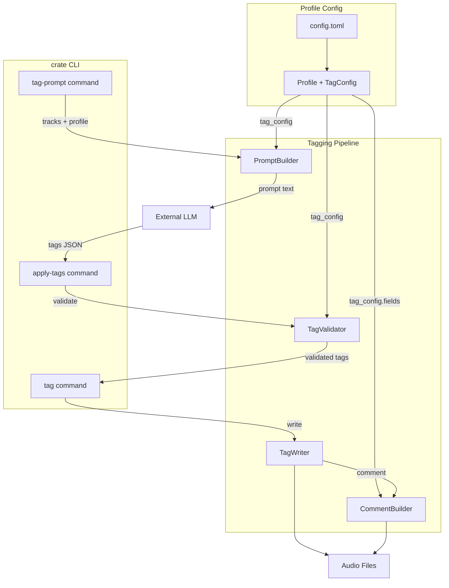

## Context

The tagging pipeline currently has a hardcoded vocabulary (`VALID_ENERGY`, `VALID_FUNCTION`, `VALID_CROWD`, `VALID_MOOD` in `tag_writer.py`) and a static LLM prompt template (`tag_prompt.py`). These are shared across all profiles. The profile system (`config.py`) already differentiates `tag_format`, `required_fields`, and genre buckets per profile, but tag vocabulary and prompt structure are global constants.

This means an electronic profile gets prompted with "singalong" functions and "family" crowds — concepts irrelevant to club/festival DJ sets. Electronic sets need set-position thinking (warm-up, peak-time, cooldown), mix-technical traits (loop-friendly, long-intro), and electronic-specific moods (hypnotic, driving, acidic).

**In-force ADRs**: ADR-0001 (Plan base class with type discriminator) — no conflict. Tags live on Track within a Plan; the polymorphic Plan base is unaffected by tag vocabulary changes.

## Goals / Non-Goals

**Goals:**
- Each profile defines its own tag fields, vocabulary, and classification guidance
- LLM prompt assembled dynamically from profile config
- Strict validation rejects values outside profile vocabulary
- Structured comment format adapts to profile's field set
- Backward compatible: no config → current commercial behavior

**Non-Goals:**
- GUI for tag vocabulary editing
- Runtime tag field type system (beyond string lists)
- Per-track vocabulary overrides (always per-profile)
- Prompt template as a separate file (config-inline structured approach chosen)
- Migration command for re-tagging (handled by normal re-run)

## Decisions

### 1. Tag config lives in `[profiles.<name>.tags]` TOML table

```toml
[profiles.electronic.tags]
guidance = "Classify for a club/festival DJ set. Think in terms of set position and energy arc."

[profiles.electronic.tags.fields.energy]
type = "single"
values = ["low", "mid", "high"]

[profiles.electronic.tags.fields.function]
type = "list"
pick = [1, 3]
values = ["warm-up", "build", "peak-time", "breakdown", "cooldown", "closer"]

[profiles.electronic.tags.fields.mood_tags]
type = "list"
pick = [1, 4]
values = ["hypnotic", "driving", "atmospheric", "deep", "acidic", "industrial", "melodic", "dark", "euphoric", "groovy"]

[profiles.electronic.tags.fields.mix_traits]
type = "list"
pick = [1, 3]
values = ["loop-friendly", "long-intro", "long-outro", "vocal", "instrumental", "acapella-section"]
```

**Rationale**: Structured TOML is parseable, validatable, and self-documenting. The `type` + `pick` + `values` pattern is uniform across all fields. `guidance` is a short preamble injected into the prompt, not a full template — code handles assembly.

**Alternative considered**: Full prompt template as inline TOML string. Rejected because prompt structure (JSON schema, track context, vocabulary rendering) is mechanical — only the guidance and vocabulary values are profile-specific. Embedding 70+ lines of prompt in config is fragile and duplicative.

### 2. New `TagFieldDef` and `TagConfig` dataclasses

```python
@dataclass
class TagFieldDef:
    name: str
    type: str          # "single" | "list"
    values: list[str]
    pick: tuple[int, int] | None = None  # min, max for list fields

@dataclass
class TagConfig:
    fields: dict[str, TagFieldDef]
    guidance: str = ""
```

`Profile` gains a `tag_config: TagConfig` attribute. When no `[profiles.X.tags]` section exists, a default `TagConfig` is built matching current hardcoded vocabulary (backward compat).

**Rationale**: Typed dataclasses give IDE support, enable validation at config-load time, and are consistent with existing `Profile`/`SortRule` pattern.

### 3. Prompt builder becomes profile-aware

`build_tag_prompt(tracks, tag_config)` replaces hardcoded vocabulary references with dynamic rendering from `TagConfig.fields`. The guidance section uses `TagConfig.guidance` instead of the static classification guidance.

The prompt structure remains:
1. System role preamble
2. Vocabulary constraints (from `tag_config.fields`)
3. JSON output schema (from `tag_config.fields`)
4. Classification guidance (from `tag_config.guidance`)
5. Track context lines (unchanged)
6. "Return ONLY JSON" instruction

**Alternative considered**: Completely separate prompt templates per profile. Rejected because 90% of the prompt structure is mechanical (track rendering, JSON schema, instruction framing). Only vocabulary and guidance differ.

### 4. Validation checks against profile vocabulary

`apply_tags()` receives `tag_config` and validates each incoming tag value against the corresponding `TagFieldDef.values`. Unknown values → hard rejection with clear error listing the invalid values and valid alternatives.

**Rationale**: User chose strict validation. Soft validation would let LLM hallucinations through silently.

### 5. Structured comment layout driven by profile fields

The comment builder iterates `tag_config.fields` in definition order rather than hardcoding `era:X; energy:X; function:X; crowd:X; mood:X`. Electronic profile produces `era:X; energy:X; function:X; mood:X; mix:X`. Era remains implicit (derived from release year, not a tag field).

### 6. Track model uses dynamic tag storage

Instead of fixed `energy`, `function`, `crowd`, `mood_tags` fields, Track gains a generic `tags: dict[str, str | list[str]]` alongside the existing fields (kept for backward compat). The tag writer reads from `tags` dict when present, falling back to legacy fields.

**Alternative considered**: Add `mix_traits` as another fixed field. Rejected because future profiles may define entirely different field sets (e.g., a "wedding" profile with "moment" field). Generic dict avoids model changes per vocabulary extension.

## Component Diagram



**Boundaries:**
- Config layer parses TOML → `Profile` with embedded `TagConfig`
- Pipeline components receive `TagConfig` as dependency, no longer import constants
- LLM interaction remains external (prompt out, JSON in)
- Audio file writing unchanged except comment format uses dynamic field list
- CLI commands resolve profile → pass `tag_config` to pipeline functions

## Risks / Trade-offs

- **Config complexity** → Users must define tag vocab in TOML. Mitigated: ship sensible defaults when no `[tags]` section exists.
- **TOML verbosity** → Field definitions are verbose. Mitigated: profile can omit `[tags]` entirely to get defaults. Only override when needed.
- **Generic `tags` dict on Track** → Loses type safety on individual fields. Mitigated: keep legacy fields for backward compat; `tags` dict is the forward-looking storage.
- **Re-tagging burden** → Changing profile vocabulary invalidates existing tags (strict validation rejects old values on next `apply-tags`). Mitigated: this is intentional — user chose re-tag-on-next-run semantics.
- **LLM prompt drift** → If user defines many fields or long vocab lists, prompt may exceed token limits. Mitigated: warn if prompt exceeds threshold (e.g., 4K tokens).

## Migration Plan

1. Add `TagFieldDef`, `TagConfig` dataclasses to `config.py`
2. Extend `_build_profile()` to parse optional `[profiles.X.tags]` section
3. Build default `TagConfig` from current `VALID_*` constants when `[tags]` absent
4. Refactor `build_tag_prompt()` to accept `TagConfig` parameter
5. Refactor `apply_tags()` validation to use `TagConfig`
6. Refactor comment builder to iterate `TagConfig.fields`
7. Add `tags: dict` to Track model; tag writer populates both legacy fields and dict
8. Update default config template with electronic tag example
9. Existing config files without `[tags]` section continue to work unchanged

**Rollback**: Since config without `[tags]` falls back to defaults, removing the feature only requires reverting code. No data migration needed.

## Open Questions

- Should `era` become a proper tag field (configurable values like "80s", "90s", "00s") or remain computed from release year? Currently it's derived, not classified.
- Should the prompt builder warn/error if total prompt token estimate exceeds a threshold? If so, what threshold?
- Should there be a `crate tag-vocab` command to inspect the active profile's vocabulary for debugging?
